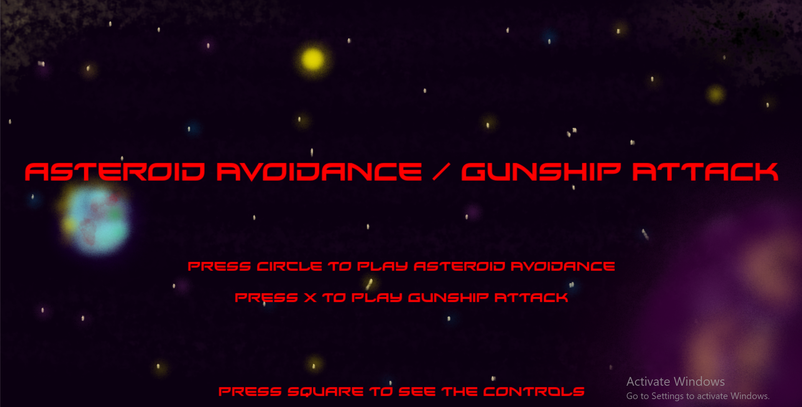
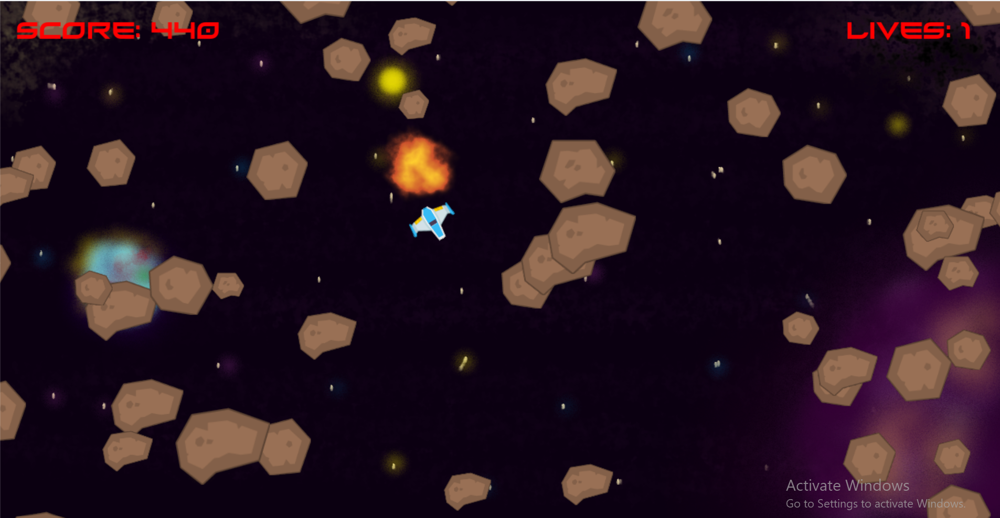
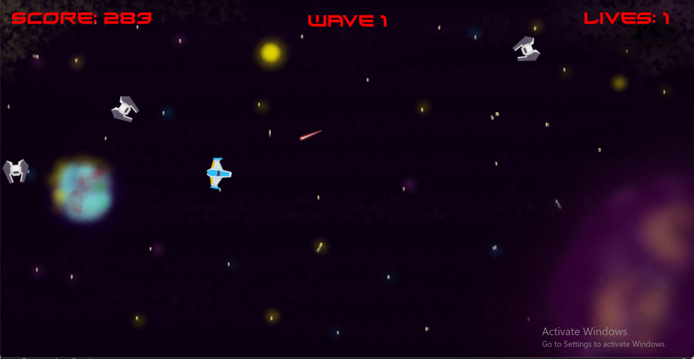
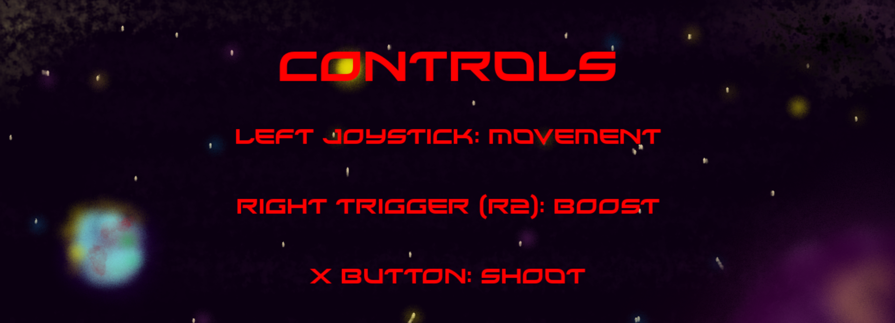

# Asteroid Avoidance / Gunship Attack

## Directions
1. Asteroid Avoidance: Avoid the moving asteroids!

2. Gunship Attack: Shoot the enemy ships! After completing a wave, the player receives an additional life!

### Controls
1. Use the left Joystick to move around
2. Right Trigger is to boost (go faster)
3. X button is to shoot

### Notes:
1. You need a controller plugged in to move the player, the program is made for a Ps5 controller, I can lend a controller if needed to play the game
2. You can still see the two different games by changing the 'state' variable on line 71 of game.py to either 'level1' or 'level2'
